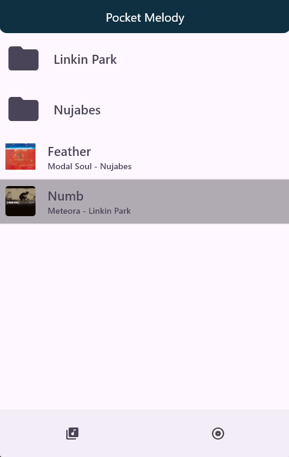
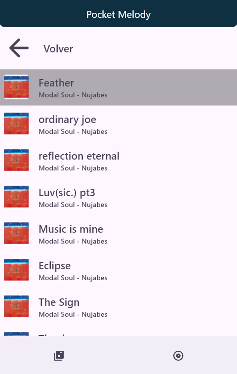
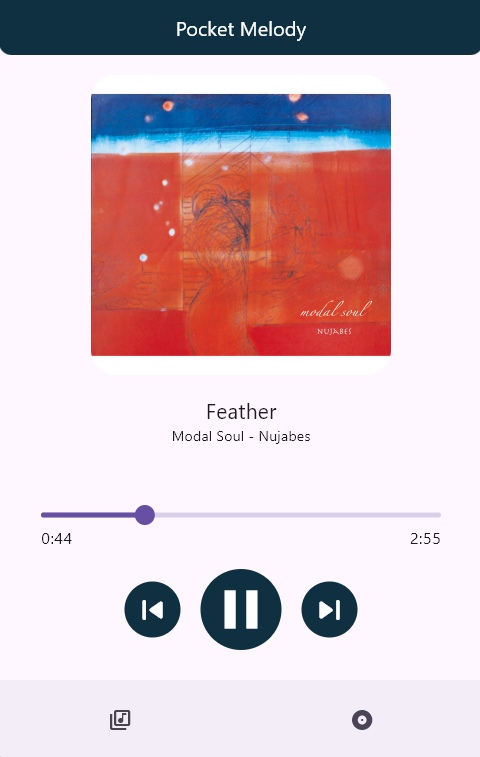

# Pocket Melody

Pocket Melody is a Windows desktop music player designed to look and feel like a mobile application. Its main purpose is to provide a first hands-on experience with the inner workings of music players, so I decided to use Flutter because of its cross-platform capabilities.

### Features

It is, quite simply, an audio file player and metadata reader, nothing more and nothing less. It reads the files stored in the default Music folder on your computer, displaying and listing their contents based on each file's metadata.

### Future implementations

- Implement a selector for the main folder from which you can browse and play your files.
    
- Improve performance in certain areas, such as preventing the "flickering" that occurs when some widgets are loaded.
    
- Improve the visual appearance.
    

### Screenshots

